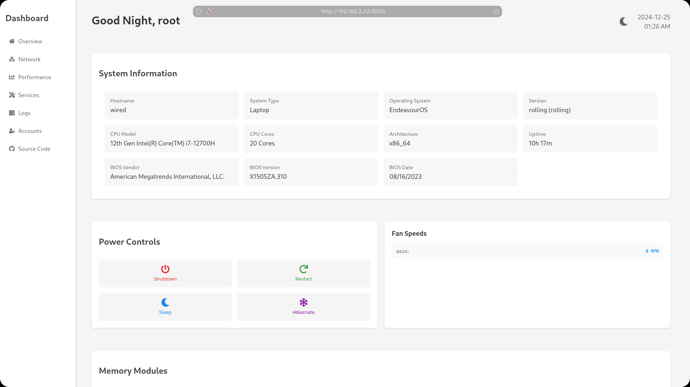
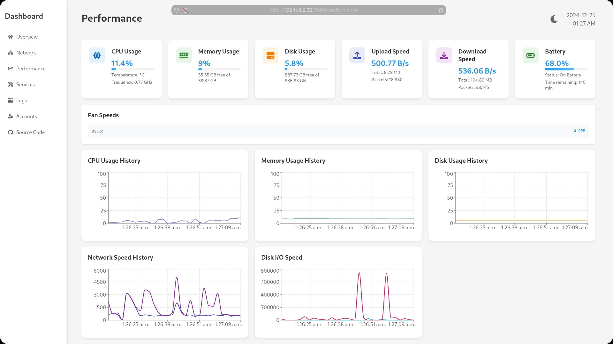
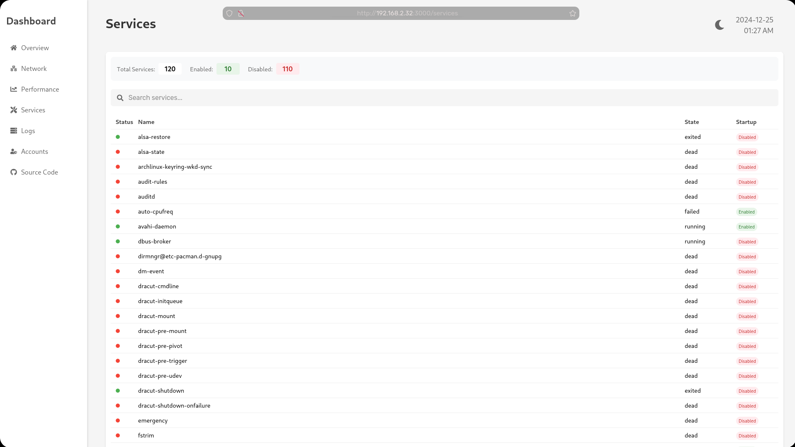

# dash

- dashboard that uses python with fastapi + psutil for backend and react for frontend

# install

```
# Install backend dependencies
pip install -r backend/requirements.txt

# Install frontend dependencies
cd frontend && npm install
```

# instructions

```
python start.py # this will open on localhost and main ip on port 3000 and 8000

# you may also need to open port 3000 and 8000 

sudo ufw allow 3000 
sudo ufw allow 8000
```

# screenshots

 
 
 
